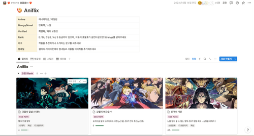
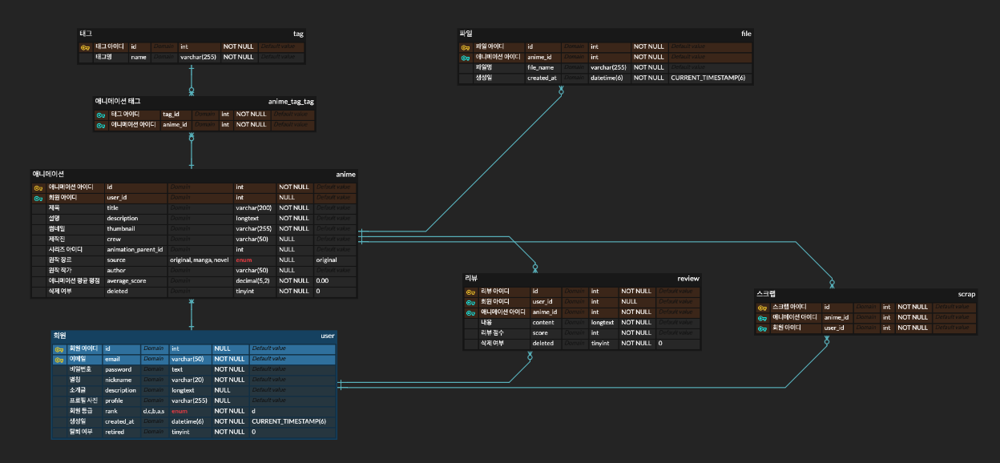
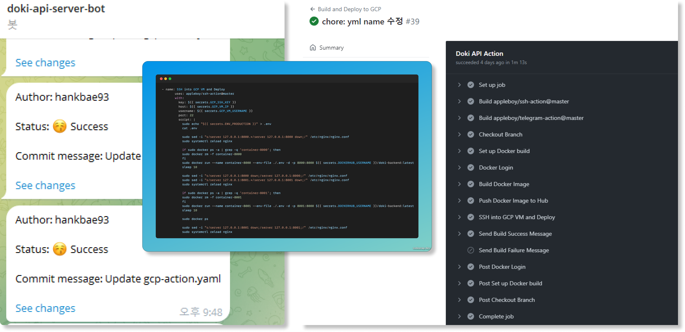
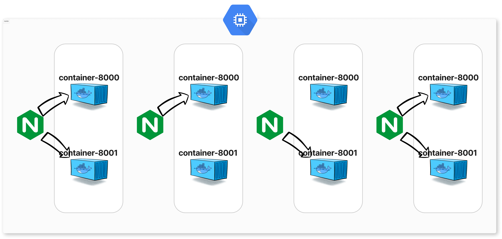
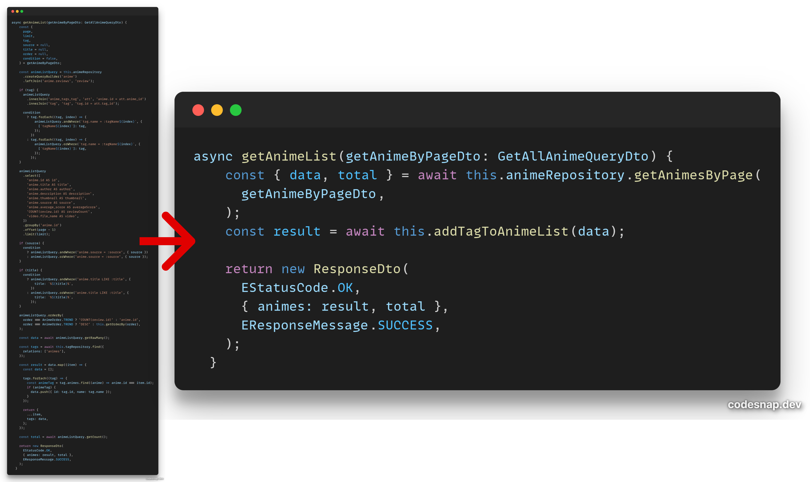

# ❤️‍🔥ドキドキ 漫画部!!! ❤️‍🔥 api-server

## introduction

직접 노션으로 제작하여 사내에 공유했던 애니메이션 커뮤니티를 웹 서비스로 구현하여 기존에 활용했던 등급제, 평점제, 커뮤니티 기능 등을 재현하였습니다.

## 구현 사항

- JWT를 활용한 인증/인가 로직 구현
- 애니메이션 조회 필터링 및 페이지네이션, AND OR 검색 구현
- 리뷰의 별점으로 애니메이션의 평점 업데이트
- 회원이 작성한 리뷰, 애니메이션 글 개수로 회원등급제도 운영
- 애니메이션과 같은 IP의 여러 작품들을 시리즈로 묶어 조회
- 회원이 맘에 드는 애니메이션을 스크랩하고 따로 조회할 수 있도록 제공

## Tech
> **Nest.js, TypeORM**
> 
> database: MySQL 8.0
> 
> tools: dbeaver, docker, erd-cloud, postman, swagger
> 
> Deploy : Docker, Google Cloud Platform(VM instance, Storage, SQL, Cloud Functions)

## 데이터베이스 설계

RDBMS의 기본 기능과 데이터 최적화를 위해 컬럼 타입을 최대한 신경썼고 기획적인 방향에 맞게 확장 가능하도록 설계했습니다.

- **계층 구조를 통한 시리즈 기능** : 극장판이나 파생되는 작품이 많은 애니메이션의 특성상 하이어라키 모델을 이용해 부모가 되는 원본 애니메이션과 같은 IP의 여러 애니메이션을 시리즈로 묶어 조회 가능하도록 설계햇습니다.

- **효율적인 리뷰 평균 점수** : 애니메이션을 조회할 때마다 모든 리뷰를 조회해 점수 평균을 구하는 것이 비효율적이라 느껴 평균 점수 컬럼을 추가하여 리뷰가 생성/갱신될 때만 평균점수를 계산하여 업데이트하였습니다.

- **스크랩** : 사용자가 좋아하는 애니메이션의 개인화된 목록을 유지할 수 있고 자신이 선택한 애니메이션을 빠르게 검색하고 관리할 수 있게 하였습니다.

- **논리적 삭제** : 후에 구현할 회원 정보 삭제 정책이나 악성 리뷰 등 조회는 되지 않게 하되 저장을 하고있어야 되기 때문에 물리적 삭제보다 최대한 논리적 삭제를 사용했습니다.

> [ERD CLOUD LINK](https://www.erdcloud.com/d/wC5eRt5xzDr6Thxtc)

## CI/CD 구성

수동으로 배포하는 과정을 자동화하기 위해 GitHub Actions를 적극적으로 활용하였습니다. Github Repository의 Main 브랜치에 새로운 Commit이 푸시될 때마다 GitHub Actions를 통해 YAML 스크립트가 실행되어 자동 배포 프로세스를 시작합니다.

- 소스 코드 변경 시 Docker 이미지를 자동으로 빌드하고 Docker Hub에 푸시

- Docker Hub에서 최신 이미지를 Pull 하여 GCP VM 인스턴스에 자동으로 배포하고, 컨테이너를 최신 상태로 유지

- Webhook을 활용하여 Telegram Bot으로 배포의 성공 여부를 실시간으로 알림

### 무중단 배포

**Rolling Deploy** 전략을 채택하여 Nginx를 이용한 리버스 프록시 설정으로 동일한 버전의 두 개의 컨테이너를 순차적으로 업데이트함으로써 서비스 중단(downtime) 없이 안정적인 배포를 달성했습니다.  `nginx.conf` 설정을 조정하여 업데이트 대상 컨테이너의 포트를 우선 중단 처리한 뒤, nginx reload 명령을 실행하여 트래픽을 새로운 컨테이너로 원활하게 전환하는 방식을 반복함으로써 구현되었습니다.

## 코드 리팩토링

### 레포지토리 패턴 적용

서비스 함수에서 비즈니스 로직과 쿼리문들이 섞여있어 유지보수하기 어려운 면을 해결하기 위해 레포지토리 패턴을 적용하였고 가독성이 훨씬 개선되었으며 데이터 조회와 비즈니스 로직 관심사가 분리되어 유지보수도 훨씬 쉬워졌습니다.

### 트랜잭션 처리용 유틸 클래스 작성

서비스 함수에서 트랜잭션 처리를 위해 반복되던 코드를 Handler 클래스로 작성하여 재사용하였습니다. 실행 전 주입된 커스텀 레포지토리와 스코프 내에서 생성된 QueryRunner가 연결되지 않는다는 문제점이 있었지만 커스텀 레포지토리 내부 함수로 커스텀 메소드가 extend되어있는 새 레포지토리로 리턴하도록 작성하여 해결했습니다.

